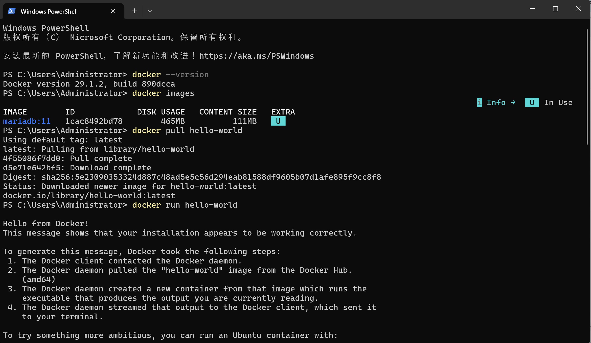
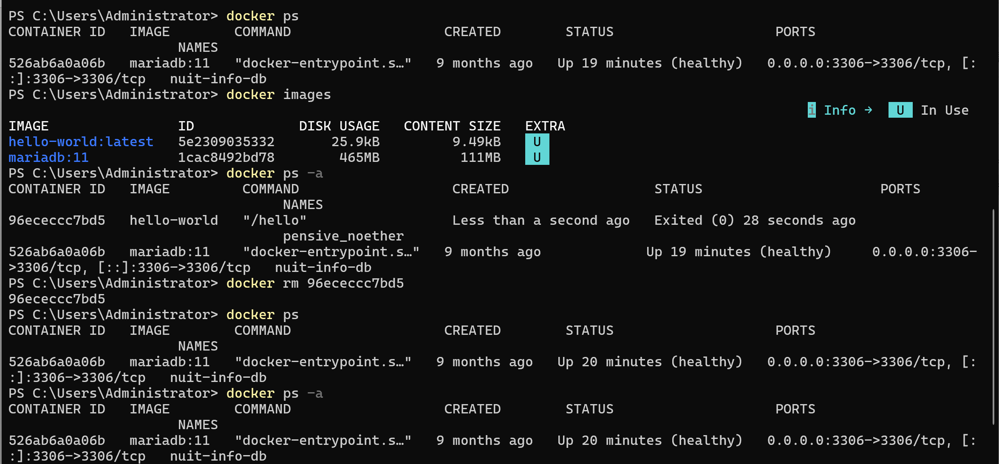
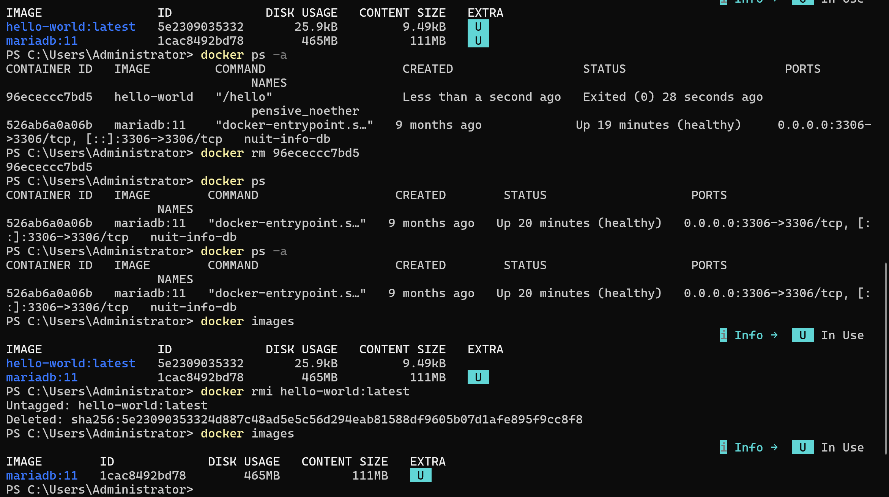
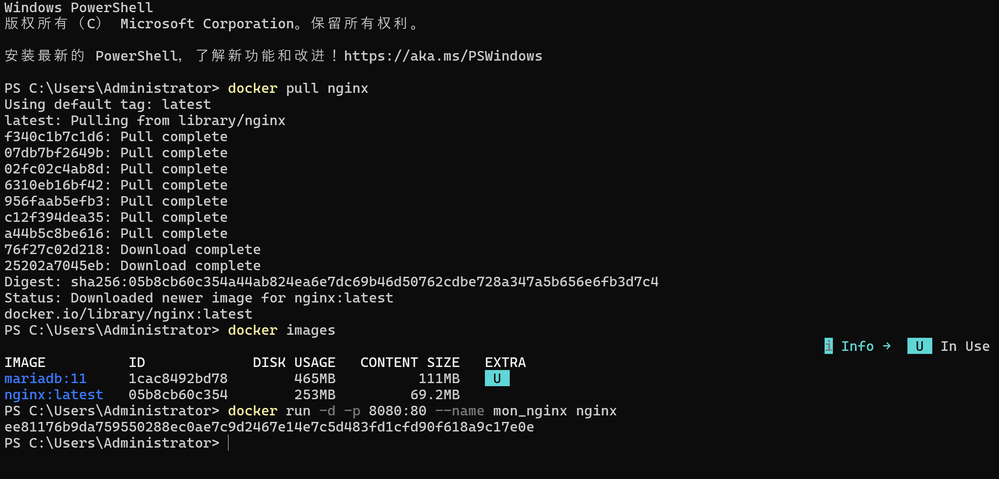
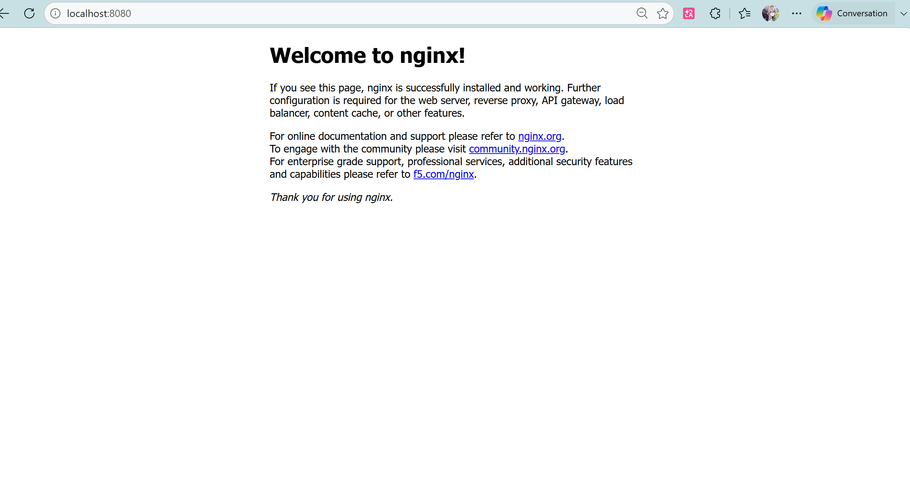
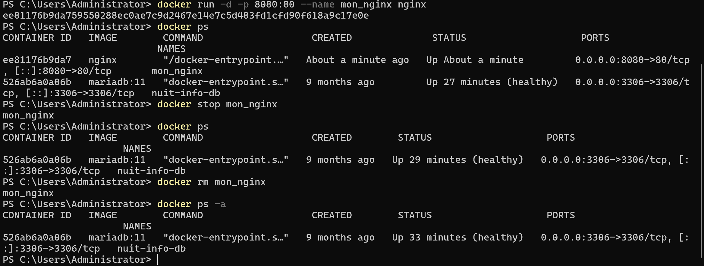

# TP Docker

## Exercice 3 : Manipulation de base des conteneurs

Dans cet exercice, nous avons effectué les manipulations de base de Docker (téléchargement d'images, exécution et suppression de conteneurs). Toutes les étapes demandées ont été réalisées avec succès.

---

### 1. Vérification, téléchargement et exécution d'un conteneur

* **Étape 1** : Vérifier la version de Docker (`docker --version`)
* **Étape 2** : Lister les images disponibles localement (`docker images`)
* **Étape 3** : Télécharger l'image officielle depuis Docker Hub (`docker pull hello-world`)
* **Étape 4** : Exécuter un conteneur à partir de l'image (`docker run hello-world`)

---

### 2. Gestion et suppression du conteneur

* **Étape 5** : Lister les conteneurs en cours d'exécution (`docker ps`)
* **Étape 6** : Lister tous les conteneurs, actifs et arrêtés (`docker ps -a`)
* **Étape 7** : Supprimer le conteneur `hello-world` (`docker rm <ID_conteneur>`)

---

### 3. Suppression de l'image Docker

* **Étape 8** : Supprimer l'image `hello-world` (`docker rmi hello-world:latest`) et vérifier la liste des images locales

---

## Exercice 4 : Création d'un serveur web avec Docker

Dans cet exercice, nous avons déployé un serveur web Nginx avec Docker (téléchargement de l'image, redirection de port, accès au navigateur et suppression du conteneur). Toutes les étapes demandées ont été réalisées avec succès.

---

### 1. Téléchargement de l'image et lancement du conteneur Nginx

* **Étape 1** : Télécharger l'image officielle Nginx (`docker pull nginx`) et vérifier les images disponibles (`docker images`)
* **Étape 2** : Lancer le conteneur Nginx en arrière-plan avec redirection de port (`docker run -d -p 8080:80 --name mon_nginx nginx`)

---

### 2. Accès au serveur web depuis le navigateur

* **Étape 3** : Vérifier que le conteneur est actif (`docker ps`)
* **Étape 4** : Accéder à l'application via le navigateur (`http://localhost:8080`) pour afficher la page par défaut de Nginx

---

### 3. Arrêt et suppression du conteneur

* **Étape 5** : Arrêter le conteneur en cours d'exécution (`docker stop mon_nginx`)
* **Étape 6** : Supprimer le conteneur (`docker rm mon_nginx`) et vérifier sa suppression définitive (`docker ps -a`)

